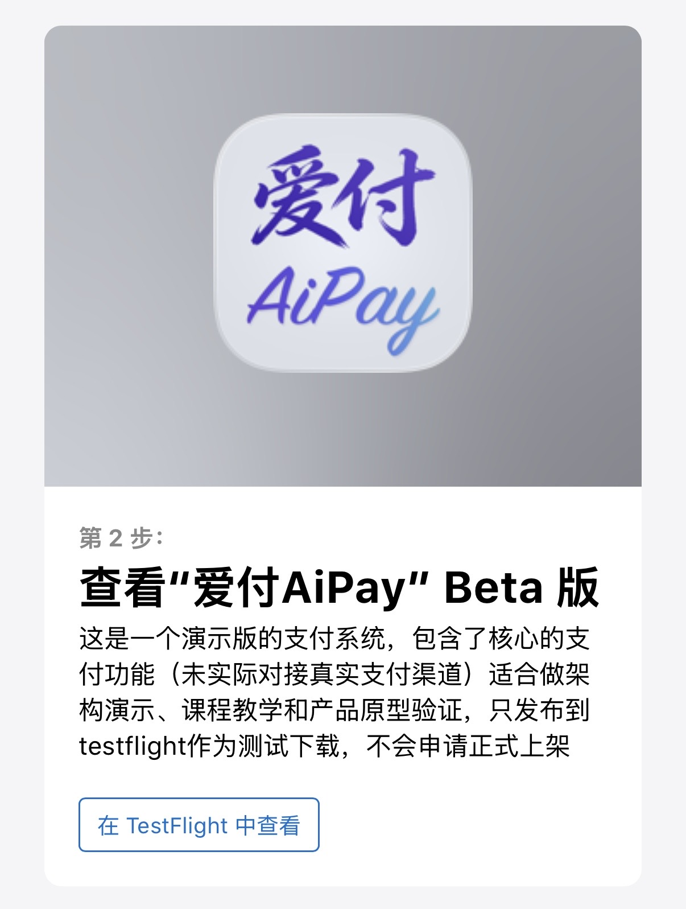
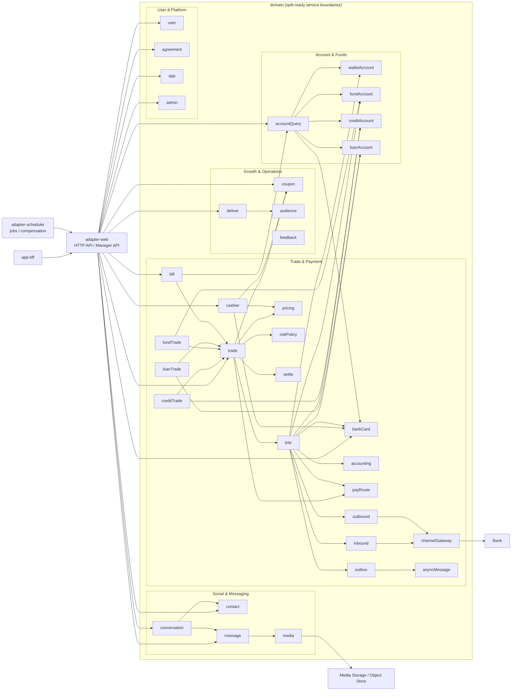

# OpenAIPay

[中文](./README.md) | English

Over the past year, especially in the last six months, AI programming has gone through an unprecedented leap. It has moved from simple code completion to understanding complex systems, participating in architectural design, and enabling agent-style tools with a degree of autonomous development capability. The software engineering production model is being redefined.

A new generation of AI coding tools, represented by Claude Code and OpenAI Codex, is evolving from “assistant tools” into “productivity engines.” More and more internet companies and software teams are exploring how AI can reshape R&D workflows, improve development efficiency, and even redefine the role boundaries of engineers.

In 21 days, I built the initial version of this project using pure Codex. The starting point was not merely to “replicate a payment app,” but to explore these questions through building a large system with real-world complexity: What is AI truly good at in complex system development? Where are its limitations in multi-module, multi-service collaboration? How should we design interaction patterns and engineering structure so AI can participate more efficiently? In real engineering, how do we move AI from an “assisted coding tool” to a “true developer”? This is a practical exploration of future software engineering modes.

Starting from end-user payment experience, I built an end-to-end payment system: the App layer for interaction and user entry points, the BFF layer for multi-client adaptation and service orchestration, and backend services covering transaction, payment, risk control, account, and bank gateway capabilities. The design is intentionally close to real production systems and helps explain how everyday actions like “scan to pay” and “tap to pay” actually work behind the scenes. So for engineers who want to understand payment system implementation, this repository is also a strong learning sample.

I hope this project helps more software engineers realize that AI is not only about efficiency gains, but also a fundamental shift in software engineering paradigms. I also hope people interested in AI and payments will join this project and help make it a representative open-source project in the AI era.

As coding itself stops being the main barrier, what matters most becomes domain modeling, system decomposition, and collaboration with intelligent agents to build large software systems. I also hope this can help more engineers shift from “code producers” to “system builders,” expand their capability boundaries with AI, and become true creators in this era.

## At a Glance

| Item | Description |
| --- | --- |
| Project type | Mobile payment super-app monorepo |
| Core modules | iOS App, NestJS BFF, Spring Boot backend, Admin console |
| Development style | Pure AI collaboration, with OpenAI Codex as the core execution engine |
| Goal | Validate sustained pure-AI delivery in a complex multi-module engineering system |
| Use cases | Product prototyping, technical demo, payment flow verification |

### iOS Download

Please install TestFlight from the App Store first, then scan the QR code to install the iOS build.

<p align="left">
  
</p>

After opening it, tap "View in TestFlight", then tap Install.

<p align="left">
  
</p>

## Scope

- Mobile product experience: registration, KYC, login, top-up, withdrawal, transfer, red packets, mobile recharge, banner delivery, add-friend chat, and financial product scenarios such as AiCash, AiCredit, and AiLoan.
- Fund and transaction core: cashier, trade, pay & routing, accounts, inbound/outbound flows, pricing, settlement, accounting.
- Admin operations: users, trades, inbound/outbound, coupon redemption, pricing, delivery, risk controls, App management, accounting, and message delivery.

## Highlights

- Not a single-page demo: this is a runnable combination of product UX + fund core + admin operations.
- High-fidelity native iOS pages for key user journeys.
- Backend follows domain-driven, hexagonal design with clear module boundaries.
- Admin console is deployed with backend in the same origin for simple local operation.
- Suitable for demos, engineering validation, and continuous iteration.

## AI-First Development

This project is not a traditional codebase that merely “used some AI assistance”. It was built with an “engineer-led design + pure AI implementation” workflow:

- OpenAI Codex directly participated in requirement decomposition, solution design, coding, page restoration, data scripts, bug fixing, and documentation.
- The engineering scope covers the iOS App, NestJS BFF, Java backend, admin console, database migrations, and test scripts.
- The goal is not to showcase isolated generation ability, but to validate sustained pure-AI delivery in a complex multi-module system.
- This repository itself can also be seen as an engineering sample of a “pure-AI-built payment super-app sandbox”.

## Quick Navigation

- [Quick Start](#quick-start)
- [Tech Stack](#tech-stack)
- [Architecture](#architecture)
- [App Features](#app-features)
- [BFF Features](#bff-features)
- [Admin Features](#admin-features)
- [Installation & Run](#installation--run)
- [Database Initialization & Migration](#database-initialization--migration)
- [Tests](#tests)
- [Current Status](#current-status)
- [Roadmap](#roadmap)

## Quick Start

### 1) Clone

```bash
git clone git@github.com:openaipay/openaipay.git openaipay
cd openaipay
```

### 2) Prerequisites

- JDK `21`
- Maven `3.9+`
- Node.js `22`
- Xcode `16+`
- Docker / Docker Compose

### 3) Start local database

```bash
docker compose -f docker-compose.local.yml up -d
```

### 4) Start backend and BFF

```bash
OpenAIPay_DB_HOST=127.0.0.1 \
OpenAIPay_DB_PORT=3306 \
OpenAIPay_DB_NAME=portal \
OpenAIPay_DB_USERNAME=openaipay \
OpenAIPay_DB_PASSWORD=openaipay \
mvn -f backend/adapter-web/pom.xml spring-boot:run
```

```bash
(cd app-bff && npm ci && BACKEND_BASE_URL=http://127.0.0.1:8080 npm run start:dev)
```

### 5) Start App and Admin

```bash
open iOS-app/OpenAiPay.xcodeproj
```

- iOS Simulator: `iPhone 17 Pro`
- Admin console: `http://127.0.0.1:8080/manager`
- For real-device debugging or overriding default endpoints, see [`ios-app/README.md`](./ios-app/README.md)

## Local One-Command Guard Start

If you want backend + BFF guarded together on local machine:

```bash
OpenAIPay_DB_HOST=127.0.0.1 \
OpenAIPay_DB_PORT=3306 \
OpenAIPay_DB_NAME=portal \
OpenAIPay_DB_USERNAME=openaipay \
OpenAIPay_DB_PASSWORD=openaipay \
./scripts/start-backend-bff-guard.sh
```

Stop:

```bash
./scripts/stop-backend-bff-guard.sh
```

Logs:

- `./.run_logs/backend.log`
- `./.run_logs/bff.log`

## Project Positioning

OpenAIPay is currently closer to a combination of a “high-fidelity product prototype + runnable fund core + admin operations system”:

- The client App aims to reproduce the interaction and visual fidelity of a real mobile payment product.
- The backend is not simple CRUD. It is split by domain-driven and hexagonal boundaries across transaction and fund capabilities.
- The admin console is embedded directly in backend static pages so the system can run locally as one integrated sandbox.
- Most demo data, seeded accounts, accounting subjects, and admin menus can be initialized automatically through migration scripts.

## Tech Stack

| Layer | Technology | Notes |
| --- | --- | --- |
| iOS App | Swift 5, SwiftUI, XcodeGen, Xcode / xcodebuild | Native iPhone client that delivers the core product UX |
| Mobile BFF | NestJS 11, TypeScript 5, Axios, Jest | Aggregation, auth, error wrapping, and controlled proxying |
| Core backend | Java 21, Spring Boot 3.4, MyBatis-Plus 3.5, Flyway, MySQL 8 | Core capabilities for trade, pay, accounts, messaging, and admin |
| Scheduler | Spring Context Scheduler | Async polling, AiCash yield settlement, and pay compensation sweeps |
| Admin UI | HTML / CSS / JavaScript | Embedded inside `backend`, without a separate frontend project |
| Tests | JUnit5, Mockito, Jest, Supertest, Swift Package Tests | Covers backend, BFF, and core iOS logic |
| CI | GitHub Actions | Runs backend / BFF / iOS core tests automatically |

## Architecture

```mermaid
flowchart LR
    iOS[iOS App]
    Manager[Admin Browser]
    BFF[app-bff / NestJS]
    Backend[backend / Spring Boot]
    DB[(MySQL)]
    Scheduler[adapter-scheduler]

    iOS -->|/bff/*| BFF
    iOS -. fallback direct calls .->|/api/*| Backend
    BFF -->|HTTP| Backend
    Manager -->|/manager + /api/admin/*| Backend
    Backend --> DB
    Scheduler --> Backend
```

### Local runtime routing

- iOS simulator targets local services:
  - BFF: `http://127.0.0.1:3000`
  - Backend: `http://127.0.0.1:8080`
- For real-device endpoint overrides, see [`ios-app/README.md`](./ios-app/README.md)
- Admin is same-origin with backend:
  - Page: `/manager`
  - APIs: `/api/admin/**`
- BFF includes a controlled `/api/*` proxy and aggregation layer, and forwards requests to `BACKEND_BASE_URL` by default.

## Project Structure

| Directory | Description |
| --- | --- |
| `iOS-app` | Native iOS client and Swift package tests |
| `app-bff` | Mobile BFF for aggregation, auth, proxy, and response wrapping |
| `backend` | Java multi-module backend (domain/application/infrastructure/adapters) |
| `scripts` | Startup, verification, and utility scripts |

## Backend Layered Architecture

### Maven modules

| Module | Description |
| --- | --- |
| `backend/domain` | Core domain models, value objects, domain services, repository interfaces |
| `backend/application` | Application services, facades, command/query orchestration |
| `backend/infrastructure` | Persistence implementations, mappers, gateway adapters |
| `backend/adapter-web` | Spring Boot web entry, C-end APIs, admin APIs, static admin assets |
| `backend/adapter-scheduler` | Scheduled jobs for async delivery, fund settlement, compensation sweeps |

### Typical DDD / Hexagonal call chain

```text
Controller -> Application Service/Facade -> Domain Service/Aggregate -> Mapper/Gateway
```

### Backend Module Dependencies (Microservice-style View)

> Deployed as a monolith today, but organized by service boundaries so modules can be split independently later.



## App Features

The current iOS App already covers the key user journeys of a payment super-app. The major capabilities are:

| Feature Area | Key Capabilities |
| --- | --- |
| Registration & Login | Mobile registration, KYC, carrier-based mobile verification login, password login, and session restoration |
| Home | Scan, Pay/Collect, Transfer, Red Packet, Mobile Recharge, Bank Card management, and in-app search |
| Pay & Collect | Contact-based transfer, payment code, collection code, and preferred payment method management |
| Top-up & Withdrawal | Channel gateway integration, tiered pricing, and fund detail viewing |
| Red Packets | Cover selection, recipient selection, payment confirmation, chat delivery, and claim posting |
| Mobile Recharge | Recharge for all three major carriers with coupon deduction support |
| Delivery | Home banners with personalized delivery support |
| AiCash | Account opening, transfer in/out, yield display, and multiple payment scenarios |
| AiCredit | Credit consumption, bill, and repayment flows |
| AiLoan | Borrowing and repayment related flows |
| Messaging & Conversations | Contact management, add-friend search, conversation list, and chat messages for text, image, transfer, and red packet |
| Bills & Assets | Aggregated display of all platform transaction bills and personal asset overview |
| Common Capabilities | Certificate display, profile management, QR business card, feedback/complaints, and App version check/upgrade |

### End-to-End Flow Value

- Supports a full loop of “transaction initiation -> cashier pricing preview -> payment invocation -> channel gateway integration -> result receipt -> account processing -> bill persistence -> asset display”.
- Red packets support a full loop of “send -> chat delivery -> claim posting -> bill record”.
- Multiple financial products (AiCash / AiCredit / AiLoan) are already connected to the same base payment chain inside one App.

### Page Restoration Strategy

Some high-fidelity pages use a “reference screenshot background + dynamic data overlay” approach so the visual restoration stays intact while still supporting live data replacement, interaction linkage, and runtime display.

## BFF Features

`app-bff` is the mobile-facing interface layer. It is not traditional Web SSR, but rather the aggregation and boundary layer for the mobile App.

### Main responsibilities

- Unified `/bff/*` aggregation APIs
- Unified error envelope and request IDs
- Bearer token auth and user access checks
- Controlled `/api/*` proxying to backend
- Header passthrough and request context propagation
- Caching, timeout, and retry control for selected query APIs

### Current BFF modules

| Module | Notes |
| --- | --- |
| `auth` | Login and token-related APIs |
| `user-flow` | Registration and user-flow orchestration |
| `user` | User profile and recent contact views |
| `asset` | Asset overview aggregation |
| `account` | Account snapshots (AiCash/AiCredit/AiLoan) |
| `bill` | Bill list aggregation |
| `cashier` | Cashier display and pricing preview data |
| `trade` | Transfer/top-up/withdraw/payment APIs |
| `contact` | Search, relation, request handling |
| `message` | Conversation and message APIs |
| `media` | Image/media upload/read |
| `coupon` | Coupon/red packet APIs |
| `deliver` | Home delivery and event APIs |
| `feedback` | Feedback work-order APIs |
| `mobile-app` | App version/device/report APIs |
| `page-init` | Page initialization aggregation |
| `search` | Home search aggregation |
| `proxy` | Controlled passthrough APIs |

## Backend Core Capabilities

### Unified trade and pay

- `trade` accepts business-side requests for payment, transfer, top-up, and withdrawal
- `pay` orchestrates specific payment tools and participants
- Each account domain maintains its own balance truth and ledger truth
- Supports idempotency, state transitions, result queries, and failure compensation

### Account domains

- Wallet balance domain: available/frozen/deduction/release
- AiCash account in/out and income settlement
- AiCredit quota/bill/repayment chain
- AiLoan borrow/repay/disbursement chain

### Inbound / Outbound

- Inbound: top-up acceptance and channel result handling
- Outbound: withdrawal acceptance, result confirmation, and failure compensation
- Coordinated with internal account domains through idempotent calls, synchronous processing, and follow-up compensation

### Async mechanisms

The repository already includes an internal async mechanism instead of depending on an external MQ before the system can run:

- `asyncMessage`: async message table and polling delivery
- `outbox`: cross-module event outbox and dead-letter monitoring
- `adapter-scheduler`:
  - `AsyncMessagePollingScheduler`
  - `FundIncomeSettlementScheduler`
  - `PayReconSweepScheduler`

This design is suitable for getting consistency and compensation chains running inside a single system first, and then evolving to external MQ later.

### Accounting

The repository already includes an independent `accounting` domain instead of scattering accounting logic across trade and account tables.

Current capabilities include:

- Accounting event `AccountingEvent`
- Voucher `AccountingVoucher`
- Entry `AccountingEntry`
- Subject `AccountingSubject`
- Standard subject initialization
- Voucher reversal
- Admin-side querying and failure retry support

## Admin Features

The admin console is served directly by backend. Entry:

- `http://127.0.0.1:8080/manager`

Default seeded admin:

- Account: `admin`
- Password: `Admin@123456`

### Current admin centers

| Center | Capabilities |
| --- | --- |
| Workspace | Admin initialization, permission loading, and menu loading |
| User Center | User list, user detail, and status updates |
| App Center | App list, version management, prompt switches, device list, and visit records |
| Message Center | Conversations, message records, red packet records, friend requests, friend relations, and blacklist |
| Fund Center | Wallet account, AiCash account, AiCredit account, AiLoan account, bank cards, and cashier view |
| Risk Center | Risk users, blacklist, KYC, and risk information |
| Trade Center | Query the unified trade chain by trade number, request number, and business order number |
| Inbound Center | Inbound order query, status, and channel result view |
| Outbound Center | Outbound order query, status, and channel result view |
| Accounting Center | Accounting events, vouchers, entries, subjects, voucher reversal, and subject initialization |
| Red Packet Center | Red packet templates, issuance, redemption, and user coupon records |
| Delivery Center | Placements, delivery units, materials, creatives, targeting (audience, time, geography), and fatigue control |
| Feedback Center | User feedback tickets |
| Permission Center | Admin users, roles, menus, and permission grants |
| Message Delivery Center | Delivery overview, topic distribution, and dead-letter troubleshooting |

### Admin implementation notes

- The admin frontend is not a separate React/Vue project. It is embedded as static pages.
- Pages communicate with `/api/admin/**` under the same origin.
- Menus, roles, and permissions in the permission center are initialized by database migration scripts.
- Suitable for local demos and integration debugging.

## Installation & Run

### Environment

- JDK `21`, Maven `3.9+`, Node.js `22`, Xcode `16+`
- MySQL `8.0+` (you can start local DB quickly via `docker-compose.local.yml`)

For detailed startup steps, please use [Quick Start](#quick-start).

### Admin Account

| Account | Password |
| --- | --- |
| `admin` | `Admin@123456` |

## Database Initialization & Migration

- Local bootstrap script: `db/sql/init_local.sql`
- Default strategy: schema + base config + admin/permission seed data; no C-end business runtime data pre-seeded

`db/sql/` file map:

- `db/sql/00_schema.sql`: schema and DDL bundle
- `db/sql/10_base_dict_config.sql`: foundational dictionary/configuration DML
- `db/sql/20_admin_seed.sql`: admin account/menu/role/permission seed data
- `db/sql/init_local.sql`: local one-shot entry (sources `00 -> 10 -> 20` in order)

Local initialization example:

```bash
mysql -h127.0.0.1 -P3306 -uopenaipay -p portal < db/sql/init_local.sql
```

## Build & Deploy

### Backend

```bash
mvn -f backend/pom.xml -pl adapter-web -am -DskipTests package
java -jar backend/adapter-web/target/adapter-web-0.1.0-SNAPSHOT.jar
```

### app-bff

```bash
(cd app-bff && npm ci && npm run build)
```

```bash
(cd app-bff && PORT=3000 BACKEND_BASE_URL=http://127.0.0.1:8080 npm run start:prod)
```

### Admin

Admin frontend is bundled with backend, no separate frontend build is required.

Once backend is running, access:

```text
http://127.0.0.1:8080/manager
```

### iOS

```bash
xcodebuild \
  -project iOS-app/OpenAiPay.xcodeproj \
  -scheme OpenAiPay \
  -configuration Debug \
  -sdk iphonesimulator \
  -destination 'platform=iOS Simulator,name=iPhone 17 Pro' \
  CODE_SIGNING_ALLOWED=NO \
  build
```

## Key Environment Variables

### Backend

| Variable | Description |
| --- | --- |
| `SERVER_PORT` | backend port, default `8080` |
| `OpenAIPay_DB_HOST` | DB host |
| `OpenAIPay_DB_PORT` | DB port |
| `OpenAIPay_DB_NAME` | DB name |
| `OpenAIPay_DB_USERNAME` | DB user |
| `OpenAIPay_DB_PASSWORD` | DB password |
| `OpenAIPay_TOKEN_SIGNING_SECRET` | token signing secret |

### BFF

| Variable | Description |
| --- | --- |
| `PORT` | BFF port, default `3000` |
| `BACKEND_BASE_URL` | backend base URL |
| `BFF_TOKEN_SIGNING_SECRET` | BFF token secret |

## Tests

### One-command test

```bash
./scripts/test-all.sh
```

### Per-module tests

```bash
mvn -pl backend/adapter-web -am test
```

```bash
(cd app-bff && npm ci && npm test -- --runInBand && npm run test:e2e)
```

```bash
swift test --package-path iOS-app
```

## CI

GitHub Actions includes:

- backend tests
- BFF unit tests
- BFF e2e tests
- iOS core tests

Workflow file:

- `.github/workflows/ci.yml`

## Current Status

- iOS delivers major user flows (home, transfer, chat, contacts, AiCash/AiCredit/AiLoan)
- BFF handles aggregation, auth guard, proxy, and response normalization
- Backend supports trade, pay orchestration, account domains, inbound/outbound, pricing, async compensation, accounting
- Admin console supports operation/risk/finance troubleshooting
- Migration scripts, foundational init data, admin permissions model, and accounting subjects are in place

## Roadmap

### Next Steps

- bug fixes
- continue refining iOS page details, interaction consistency, and multi-device compatibility
- further refine product-domain boundaries and keep improving the unified trade and pay model
- continue expanding core product capabilities such as AiCash and delivery, and strengthen admin-side operations
- implement credit card repayment, fund, and video features, and continue expanding the payment domain, including open platform, financial-institution / merchant reconciliation and accounting, and e-commerce payment scenarios
- strengthen automated regression coverage and fill more end-to-end acceptance scenarios
- Android App implementation
- form a reusable pure-AI collaboration methodology and engineering template

## Wechat Official Account

I will also share the project development process and related articles on the wechat official account.


