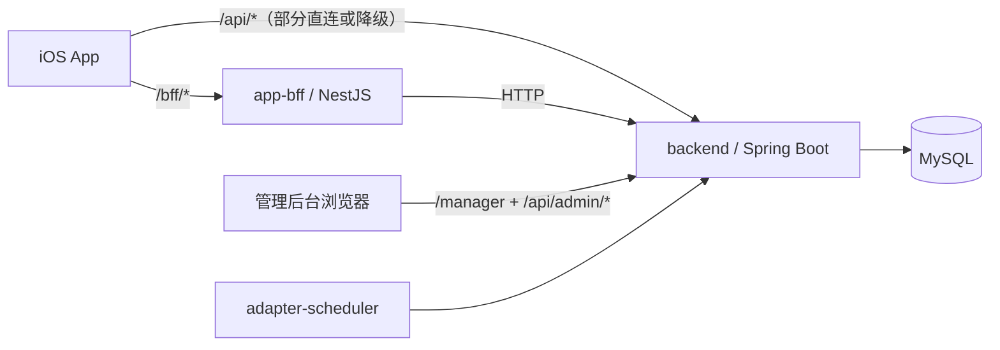
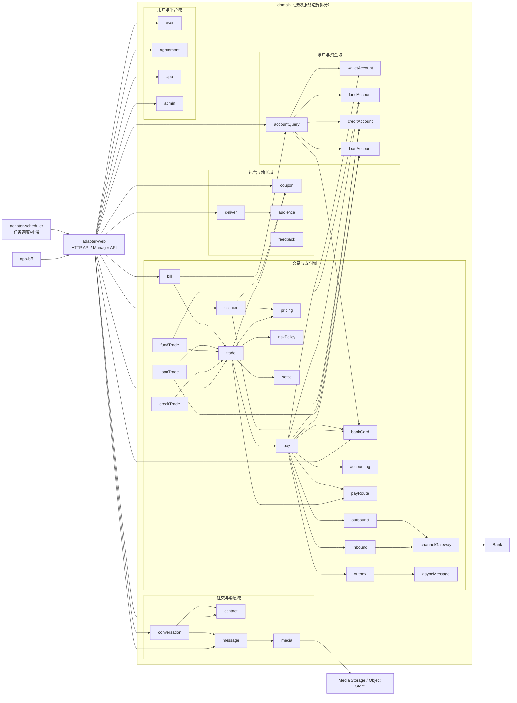

# OpenAIPay

中文 | [English](./README.en.md)

过去的一年，尤其是最近半年，AI编程能力经历了前所未有的跃迁。从简单的代码补全和重构，到能够理解复杂系统、参与架构设计，再到具备一定自主开发能力的智能体工具，软件工程的生产方式正在被重新定义。

以Claude Code、OpenAI Codex为代表的新一代AI编程工具，正在从“辅助工具”转变为“生产力引擎”。越来越多的互联网公司与软件团队，开始探索如何借助AI重构研发流程、提升开发效率，乃至重塑工程师的角色边界。

21天时间，我用纯Codex，构建了这个支付App的初始版本。我的出发点并非简单的复刻，而是希望通过构建一个具有真实复杂度的大型系统，去尝试探索这些问题：AI在复杂系统开发中，真正擅长解决哪些问题？在多模块、多服务协同场景下，它的局限性又体现在哪里？如何设计合理的交互方式与工程结构，让AI更高效地参与开发？在实际工程中，如何将AI从“辅助编码工具”，转变为“真正的开发者”？这是一次面向未来软件工程模式的实践。

我从用户侧的支付功能体验出发，构建了一套端到端的支付系统体系：App层的交互界面与用户操作入口，BFF层的多端适配与服务编排，以及涵盖交易、支付、风控、账户、银行网关等核心能力的后端服务，尽可能贴近真实生产系统的设计方式，能够让大家了解我们每天用的“扫一扫”，“碰一下”背后的运行机制。所以，对于想了解支付系统实现机制的同学，这也是一个很不错的学习样本。

我希望这个项目，能够让更多的软件工程师意识到，AI带来的并不仅仅是效率的提升，而是软件工程范式的根本转变。我也希望AI/支付行业有感兴趣的同学加入这个项目，让它成为AI时代一个有代表性的开源项目。

当编写代码逐渐不再是门槛，真正重要的将是如何建立领域模型，如何拆解系统，以及如何与智能体协作完成大型软件系统。也希望它能促使更多的软件工程师在AI的加持下，拓展能力边界，成为这个时代真正的创造者。

## 一眼看懂

| 维度 | 说明 |
| --- | --- |
| 项目形态 | 移动支付超级App多模块单仓库 |
| 核心组成 | iOS App、NestJS BFF、Spring Boot后端、运营后台 |
| 研发方式 | 纯AI协作研发，核心执行引擎为 OpenAI Codex |
| 工程目标 | 验证纯AI在复杂多模块工程中的持续交付能力 |
| 适用场景 | 产品原型、技术演示、资金链路验证 |

### iOS版本下载

请先在App Store下载TestFlight，然后扫码安装iOS版本。

<p align="left">
  
</p>

打开后点击“在 TestFlight 中查看”，再点击安装。

<p align="left">
  
</p>

## 覆盖范围

- 移动端产品体验：注册、实名认证、登录、充值、提现、转账、发红包、充话费，横幅投放、加好友聊天，以及爱存、爱花、爱借等金融产品场景。
- 资金核心链路：收银台、交易、支付/支付路由、账户、会计、红包、计费、出入金、网关
- 运营后台：用户、交易、入出金、红包、计费、投放、风控、App、会计、消息投递

## 项目亮点

- 不是单页Demo，而是一套可运行的“移动端产品体验 + 资金内核 + 运营后台”组合体
- 前端采用高保真原生iOS方案，提供了丝滑的支付体验
- 后端按领域驱动/六边形架构拆分，高内聚、松耦合，方便扩展和长期维护
- 管理后台与后端同源部署，丰富的后台管理功能
- 适合做演示、研发验证与持续迭代

## 纯 AI 开发方式

这个项目不是“用了部分AI辅助”的传统工程，而是一个以“工程师主导设计+纯AI实现”为研发方式完成的完整项目：

- OpenAI Codex直接参与了需求拆解、方案设计、代码实现、页面还原、数据脚本、问题修复与文档整理
- 工程内容覆盖iOS App、NestJS BFF、Java后端、管理后台、数据库迁移与测试脚本
- 项目目标不是展示单点生成能力，而是验证纯AI在复杂多模块工程中的持续交付能力
- 这个仓库本身也可以视为一个“纯AI构建支付类超级App沙盘”的工程样本

## 快速导航

- [Quick Start](#quick-start)
- [技术栈](#技术栈)
- [整体架构](#整体架构)
- [App功能说明](#app-功能说明)
- [BFF功能说明](#bff-功能说明)
- [管理后台功能说明](#管理后台功能说明)
- [安装与运行](#安装与运行)
- [当前状态](#当前状态)
- [路线图](#路线图)
- [测试与回归](#测试与回归)

## Quick Start

### 1. 获取代码

```bash
git clone git@github.com:openaipay/openaipay.git openaipay
cd openaipay
```

### 2. 准备环境

- JDK `21`
- Maven `3.9+`
- Node.js `22`
- Xcode `16+`
- Docker / Docker Compose

### 3. 启动本地数据库

```bash
docker compose -f docker-compose.local.yml up -d
```

### 4. 启动后端与 BFF

```bash
OpenAIPay_DB_HOST=127.0.0.1 \
OpenAIPay_DB_PORT=3306 \
OpenAIPay_DB_NAME=portal \
OpenAIPay_DB_USERNAME=openaipay \
OpenAIPay_DB_PASSWORD=openaipay \
mvn -f backend/adapter-web/pom.xml spring-boot:run
```

```bash
(cd app-bff && npm ci && BACKEND_BASE_URL=http://127.0.0.1:8080 npm run start:dev)
```

### 5. 启动 App 与后台

```bash
open iOS-app/OpenAiPay.xcodeproj
```

- iOS 模拟器：`iPhone 17 Pro`
- 管理后台：`http://127.0.0.1:8080/manager`
- 如需真机联调或覆盖默认接口地址，参考 [`ios-app/README.md`](./ios-app/README.md)

### 本地一键启动（守护脚本）

如果你希望本机同时守护 backend + app-bff，可以直接执行：

```bash
OpenAIPay_DB_HOST=127.0.0.1 \
OpenAIPay_DB_PORT=3306 \
OpenAIPay_DB_NAME=portal \
OpenAIPay_DB_USERNAME=openaipay \
OpenAIPay_DB_PASSWORD=openaipay \
./scripts/start-backend-bff-guard.sh
```

停止命令：

```bash
./scripts/stop-backend-bff-guard.sh
```

日志位置：

- `./.run_logs/backend.log`
- `./.run_logs/bff.log`

## 项目定位

OpenAIPay 当前更接近一个“高保真产品原型 + 可运行资金内核 + 后台运营系统”的组合体：

- 前台App追求接近真实移动支付产品的交互与视觉还原
- 后台后端不是单纯CRUD，而是按领域驱动/六边形方式拆分资金域能力
- 管理后台直接嵌在后端静态页面中，方便本机一体化运行
- 多数演示数据、账号、会计科目、后台菜单均可通过迁移脚本自动初始化

## 技术栈

| 层次 | 技术 | 说明 |
| --- | --- | --- |
| iOS App | Swift 5、SwiftUI、XcodeGen、Xcode / xcodebuild | 原生iPhone客户端，承担主要产品体验 |
| 移动端 BFF | NestJS 11、TypeScript 5、AxiOS、Jest | 做接口聚合、鉴权、错误包装、白名单代理 |
| 核心后端 | Java 21、Spring Boot 3.4、MyBatis-Plus 3.5、Flyway、MySQL 8 | 承载交易、支付、账户、消息、后台等核心能力 |
| 调度层 | Spring Context Scheduler | 异步消息轮询、爱存收益结算、支付补偿扫单 |
| 管理后台 | 原生 HTML / CSS / JavaScript | 嵌入 `backend` 工程，不单独起前端工程 |
| 测试 | JUnit5、Mockito、Jest、Supertest、Swift Package Tests | 覆盖后端、BFF与iOS核心逻辑 |
| CI | GitHub Actions | 自动执行 backend/BFF/iOS core tests |

## 整体架构



### 本地运行链路

- iOS 模拟器默认访问本机：
  - BFF：`http://127.0.0.1:3000`
  - Backend：`http://127.0.0.1:8080`
- 真机联调地址覆盖方式见 [`ios-app/README.md`](./ios-app/README.md)
- 管理后台不经过 BFF，直接由后端同源提供：
  - 页面入口：`/manager`
  - 数据接口：`/api/admin/**`
- BFF 内置受控 `/api/*` 代理和聚合能力，默认转发给 `BACKEND_BASE_URL`

## 工程总体结构

| 目录 | 说明 |
| --- | --- |
| `iOS-app` | iOS原生客户端工程与Swift Package Tests |
| `app-bff` | 移动端BFF，负责聚合、鉴权、代理与统一回包 |
| `backend` | Java多模块后端，包含领域层、应用层、基础设施层、Web适配器、调度器 |
| `scripts` | 启动、验证、守护、对账与主题校验脚本 |

## 后端分层架构

### Maven模块

| 模块 | 说明 |
| --- | --- |
| `backend/domain` | 核心领域模型、值对象、领域服务、仓储接口 |
| `backend/application` | 应用服务、Facade、Command/Query 编排 |
| `backend/infrastructure` | 持久化实现、Mapper、外部网关适配、文件存储等 |
| `backend/adapter-web` | Spring Boot Web 入口、C端接口、管理后台接口、页面文件 |
| `backend/adapter-scheduler` | 定时调度器，负责异步投递、收益结算、支付补偿扫单 |

### 典型领域驱动/六边形链路

```text
Controller -> Application Service/Facade -> Domain Service/Repository -> Mapper/Gateway
```

### 后端模块依赖（微服务化视角）

> 当前为单体部署，但按“可拆分微服务边界”组织模块，便于后续独立部署。



## App 功能说明

当前 iOS App 已覆盖支付超级 App 的关键用户路径，重点能力如下：

| 功能模块 | 主要能力（重点） |
| --- | --- |
| 注册与登录 | 手机号注册、实名认证、运营商验证码登录、密码登录、登录态恢复 |
| 首页 | 扫一扫、收付款、转账、红包、手机充值、银行卡管理等快捷入口，站内搜索 |
| 收付款 | 选联系人转账、付款码、收钱码、优先付款方式 |
| 充值提现 | 对接渠道网关，支持阶梯计费，查看资金明细 |
| 红包 | 红包封面选择、选领取人、支付确认、会话红包消息、领取入账 |
| 话费充值 | 三大运营商话费充值，支持红包抵扣 |
| 投放 | 首页横幅，支持个性化投放 |
| 爱存| 开通、转入/转出、收益展示，支持多支付场景 |
| 爱花 | 信用消费、账单与还款相关页面流程 |
| 爱借 | 借款与还款相关页面流程 |
| 消息与会话 | 联系人管理、搜索加好友、会话列表、聊天支持文本\图片\转账\红包消息 |
| 账单与资产 | 平台所有交易账单的聚合展示，个人资产汇总展示 |
| 通用能力 | 证件展示、个人信息管理、二维码名片、反馈与投诉、App版本检测与升级 |

### 端到端链路（核心价值）

- 支持“发起交易 -> 收银台试算 -> 调用支付 -> 渠道网关对接 -> 结果回执 -> 账户处理 -> 账单沉淀 -> 资产展示”的完整闭环
- 红包能力支持“发红包 -> 会话投递 -> 领取入账 -> 账单记录”的完整闭环
- 多资金产品（爱存/爱花/爱借）与基础支付链路已在同一App内打通

### 页面还原策略

部分高保真页面采用“参考图底图 + 动态数据覆盖渲染”方案：在保留视觉还原的同时，支持真实数据替换、交互联动与运行态展示。

## BFF 功能说明

`app-bff` 是移动端的接口中间层，承担的不是传统Web SSR，而是移动端聚合与边界收口。

### 主要职责

- 统一 `/bff/*` 聚合接口
- 统一错误结构和 `requestId`
- Bearer Token 鉴权
- 用户 ID 越权校验
- `/api/*` 白名单代理
- 向 backend 透传请求头、鉴权头、请求链路信息
- 对部分查询接口做缓存、超时和重试控制

### 当前 BFF 模块

| 模块 | 说明 |
| --- | --- |
| `auth` | 登录 |
| `user-flow` | 注册检查、注册流程 |
| `user` | 用户资料、最近联系人等 |
| `asset` | 资产总览与变动 |
| `account` | 爱存/爱花/爱借账户查询 |
| `bill` | 账单聚合 |
| `cashier` | 收银台视图、价格预览 |
| `trade` | 转账、充值、提现、支付 |
| `contact` | 搜索联系人、好友申请、好友列表 |
| `message` | 会话、消息、红包、已读 |
| `media` | 图片上传与媒体读取 |
| `coupon` | 红包/奖励券 |
| `deliver` | 首页 Banner 与事件上报 |
| `feedback` | 反馈工单 |
| `mobile-app` | 版本检查、设备上报、访问记录 |
| `page-init` | 页面初始化数据 |
| `search` | 首页搜索聚合 |
| `proxy` | 受控 `/api/*` 透传 |


## 后端核心业务能力

### 统一交易与支付

- `trade` 接收业务侧支付/转账/充值/提现请求
- `pay` 负责编排具体支付工具和参与方
- 各账户域分别维护自己的余额真相与流水真相
- 支持幂等、状态推进、结果查询、失败补偿

### 账户域

- 余额账户：可用、冻结、扣减、释放
- 爱存账户：转入、转出、收益结算
- 爱花账户：额度、账单、还款
- 爱借链路：借款、还款、放款相关交易

### 入金 / 出金

- 入金：充值链路、通道受理、状态落库
- 出金：提现链路、通道受理、结果确认、失败补偿
- 与内部账户域之间通过幂等、同步调用和后续补偿机制协同

### 异步机制

仓库里已经落了项目内异步机制，而不是强依赖外部 MQ 才能运行：

- `asyncMessage`：异步消息表与轮询投递
- `outbox`：跨模块事件出箱与死信监控
- `adapter-scheduler`：
  - `AsyncMessagePollingScheduler`
  - `FundIncomeSettlementScheduler`
  - `PayReconSweepScheduler`

这套设计适合单系统内先把一致性和补偿链路跑通，后续再演进到外部 MQ。

### 会计模块

仓库已包含独立的 `accounting` 领域，不再把会计逻辑散落在交易和账户表里。

当前能力包括：

- 会计事件 `AccountingEvent`
- 凭证 `AccountingVoucher`
- 分录 `AccountingEntry`
- 科目 `AccountingSubject`
- 标准科目初始化
- 凭证冲正
- 后台查询与失败重试

## 管理后台功能说明

管理后台直接由后端提供，入口为：

- 本地：`http://127.0.0.1:8080/manager`

默认种子管理员：

- 账号：`admin`
- 密码：`Admin@123456`

### 当前后台能力

| 中心 | 功能 |
| --- | --- |
| 工作台 | 后台初始化、权限与菜单加载 |
| 用户中心 | 用户列表、用户详情、状态调整 |
| App中心 | App列表、版本管理、提示开关、设备列表、访问记录 |
| 消息中心 | 会话、消息记录、红包记录、好友申请、好友关系、黑名单 |
| 资金中心 | 钱包账户、爱存账户、爱花账户、爱借账户、银行卡、收银台视图 |
| 风控中心 | 风险用户、黑名单、KYC与风险信息 |
| 交易中心 | 按交易号、请求号、业务单号查询统一交易链路 |
| 入金中心 | 入金订单查询、状态与通道结果查看 |
| 出金中心 | 出金订单查询、状态与通道结果查看 |
| 会计中心 | 会计事件、凭证、分录、科目、凭证冲正、科目初始化 |
| 红包中心 | 红包模板、发放、核销、用户红包记录 |
| 投放中心 | 展位、投放单元、素材、创意、定向（人群、时间、地理位置）、疲劳度控制 |
| 反馈中心 | 用户反馈工单 |
| 权限中心 | 管理员、角色、菜单、权限授权 |
| 消息投递中心 | 投递总览、主题分布、死信排查 |

### 后台实现特点

- 后台前端不是单独 React/Vue 工程，而是内嵌静态页
- 页面与 `/api/admin/**` 同源通信
- 权限中心菜单、角色、权限通过数据库迁移脚本初始化
- 适合本地演示与联调

## 安装与运行

### 环境要求

- JDK `21`、Maven `3.9+`、Node.js `22`、Xcode `16+`
- MySQL `8.0+`（可用 `docker-compose.local.yml` 快速拉起）

详细启动步骤请优先参考上文 [Quick Start](#quick-start)。

### 管理后台账号

| 账号 | 密码 | 
| --- | --- | 
| `admin` | `Admin@123456` |

## 数据库初始化与迁移

- 本地快速建库脚本：`db/sql/init_local.sql`
- 默认策略：初始化结构 + 基础配置 + 管理员与后台权限；不预置 C 端业务流水数据

`db/sql/` 目录文件说明：

- `db/sql/00_schema.sql`：库表结构与DDL变更汇总
- `db/sql/10_base_dict_config.sql`：基础字典、系统配置等基础 DML
- `db/sql/20_admin_seed.sql`：后台管理员、菜单、角色、权限等种子数据
- `db/sql/init_local.sql`：本地一键入口脚本（按 `00 -> 10 -> 20` 顺序 `SOURCE`）

本地初始化示例：

```bash
mysql -h127.0.0.1 -P3306 -uopenaipay -p portal < db/sql/init_local.sql
```

## 构建与部署

### Backend

```bash
mvn -f backend/pom.xml -pl adapter-web -am -DskipTests package
```

```bash
java -jar backend/adapter-web/target/adapter-web-0.1.0-SNAPSHOT.jar
```

### app-bff

```bash
(cd app-bff && npm ci && npm run build)
```

```bash
(cd app-bff && PORT=3000 BACKEND_BASE_URL=http://127.0.0.1:8080 npm run start:prod)
```

### 管理后台

管理后台已随 `backend` 一起打包，不需要单独构建前端。

只要 `backend` 启动成功，就可以访问：

```text
http://127.0.0.1:8080/manager
```

### iOS App

```bash
xcodebuild \
  -project iOS-app/OpenAiPay.xcodeproj \
  -scheme OpenAiPay \
  -configuration Debug \
  -sdk iphonesimulator \
  -destination 'platform=iOS Simulator,name=iPhone 17 Pro' \
  CODE_SIGNING_ALLOWED=NO \
  build
```

## 关键环境变量

### Backend

| 变量 | 说明 |
| --- | --- |
| `SERVER_PORT` | 后端端口，默认 `8080` |
| `OpenAIPay_DB_HOST` | 数据库主机 |
| `OpenAIPay_DB_PORT` | 数据库端口 |
| `OpenAIPay_DB_NAME` | 数据库名 |
| `OpenAIPay_DB_USERNAME` | 数据库用户名 |
| `OpenAIPay_DB_PASSWORD` | 数据库密码 |
| `OpenAIPay_TOKEN_SIGNING_SECRET` | 用户 Bearer Token 签名密钥 |

### BFF

| 变量 | 说明 |
| --- | --- |
| `PORT` | BFF 端口，默认 `3000` |
| `BACKEND_BASE_URL` | 后端地址 |
| `BFF_TOKEN_SIGNING_SECRET` | BFF Bearer Token 解析密钥 |

## 测试与回归

### 一键测试

```bash
./scripts/test-all.sh
```

### 分模块测试

```bash
mvn -pl backend/adapter-web -am test
```

```bash
(cd app-bff && npm ci && npm test -- --runInBand && npm run test:e2e)
```

```bash
swift test --package-path iOS-app
```

## CI

GitHub Actions 已配置基础 CI：

- backend tests
- app-bff unit tests
- app-bff e2e tests
- iOS core logic tests

工作流文件：

- `.github/workflows/ci.yml`

## 当前状态

- iOS端已经具备完整主流程体验，包含登录、首页、消息、联系人、爱存、爱花、爱借等核心页面
- BFF已承担移动端聚合、鉴权、代理和错误收口职责
- 后端已具备统一交易、支付编排、账户域、入金、出金、定价、异步补偿、会计能力
- 管理后台已可用于运营、财务、风控与链路排障
- 数据库迁移、基础初始化数据、管理员权限模型和标准会计科目均已落库

## 路线图

### 后续计划

- bug修复
- 持续补齐iOS页面细节与交互一致性，多机型兼容验证
- 细化产品域边界，继续优化统一交易与支付模型
- 核心产品功能完善和扩展，如爱存、投放等，后台运营能力补充
- 信用卡还款、基金、视频等功能实现，并继续完善支付域的功能，如开放平台、金融机构/商户对账及核算，实现电商支付功能
- 增强自动化测试回归能力，补足更多端到端验收场景
- Android端App实现
- 形成一套可复用的纯AI协作研发范式与工程模板

## 公众号
项目研发过程以及相关的系列文章，我会在公众号中同步


